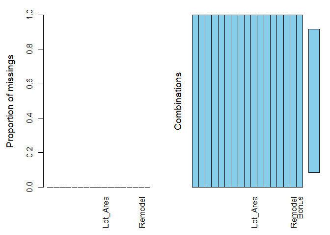
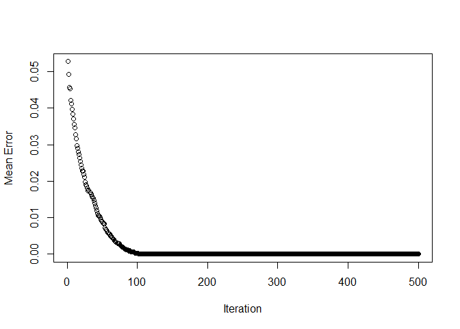
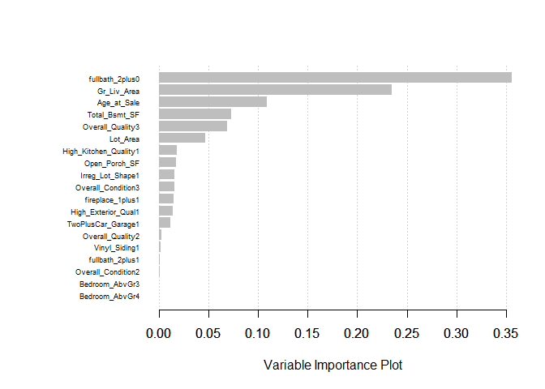

## R Markdown


```r
#loading the packages

library(tidyr)
library(dplyr)
library(caret)
library(VIM)
library(xgboost)
```

##Importing the dataset


```r
ames.df <- read.csv("D:\\Datasets\\ames7070.csv", stringsAsFactors = TRUE)
str(ames.df)
```

```
## 'data.frame':	1984 obs. of  112 variables:
##  $ Order                 : int  1 2 3 4 12 14 19 20 21 24 ...
##  $ PID                   : int  526301100 526350040 526351010 526353030 527165230 527180040 527276150 527302110 527358140 527402200 ...
##  $ MS_SubClass           : int  20 20 20 20 20 20 20 20 20 20 ...
##  $ House_Style           : Factor w/ 8 levels "1.5Fin","1.5Unf",..: 3 3 3 3 3 3 3 3 3 3 ...
##  $ FirstFlr_SF           : int  1656 896 1329 2110 1187 1341 864 2073 1844 1004 ...
##  $ SecondFlr_SF          : int  0 0 0 0 0 0 0 0 0 0 ...
##  $ Low_Qual_Fin_SF       : int  0 0 0 0 0 0 0 0 0 0 ...
##  $ Gr_Liv_Area           : int  1656 896 1329 2110 1187 1341 864 2073 1844 1004 ...
##  $ Year_Built            : int  1960 1961 1958 1968 1992 1990 1951 1978 1977 1970 ...
##  $ MS_Zoning             : Factor w/ 3 levels "RH","RL","RM": 2 1 2 2 2 2 2 2 2 2 ...
##  $ Lot_Frontage          : int  141 80 81 93 NA 85 140 85 105 NA ...
##  $ Lot_Area              : int  31770 11622 14267 11160 7980 10176 19138 13175 11751 11241 ...
##  $ Street                : Factor w/ 2 levels "Grvl","Pave": 2 2 2 2 2 2 2 2 2 2 ...
##  $ Alley                 : Factor w/ 2 levels "Grvl","Pave": NA NA NA NA NA NA NA NA NA NA ...
##  $ Lot_Shape             : Factor w/ 2 levels "IRR","Reg": 1 2 1 2 1 2 2 2 1 1 ...
##  $ Land_Contour          : Factor w/ 4 levels "Bnk","HLS","Low",..: 4 4 4 4 4 4 4 4 4 4 ...
##  $ Utilities             : Factor w/ 2 levels "AllPub","NoSewr": 1 1 1 1 1 1 1 1 1 1 ...
##  $ Lot_Config            : Factor w/ 5 levels "Corner","CulDSac",..: 1 5 1 1 5 5 1 5 5 2 ...
##  $ Land_Slope            : Factor w/ 3 levels "Gtl","Mod","Sev": 1 1 1 1 1 1 1 1 1 1 ...
##  $ Neighborhood          : Factor w/ 21 levels "Blmngtn","BrkSide",..: 10 10 10 10 7 7 7 13 13 10 ...
##  $ Condition_1           : Factor w/ 9 levels "Artery","Feedr",..: 3 2 3 3 3 3 3 3 3 3 ...
##  $ Condition_2           : Factor w/ 6 levels "Artery","Feedr",..: 3 3 3 3 3 3 3 3 3 3 ...
##  $ Bldg_Type             : Factor w/ 1 level "1Fam": 1 1 1 1 1 1 1 1 1 1 ...
##  $ Overall_Qual          : int  6 5 6 7 6 7 4 6 6 6 ...
##  $ Overall_Cond          : int  5 6 6 5 7 5 5 6 6 7 ...
##  $ Year_Remod_Add        : int  1960 1961 1958 1968 2007 1990 1951 1988 1977 1970 ...
##  $ Roof_Style            : Factor w/ 6 levels "Flat","Gable",..: 4 2 4 4 2 2 2 2 4 2 ...
##  $ Roof_Matl             : Factor w/ 6 levels "CompShg","Membran",..: 1 1 1 1 1 1 1 1 1 1 ...
##  $ Exterior_1st          : Factor w/ 14 levels "AsbShng","BrkComm",..: 3 12 13 3 6 6 12 9 9 13 ...
##  $ Exterior_2nd          : Factor w/ 16 levels "AsbShng","AsphShn",..: 10 14 15 4 7 7 14 10 10 15 ...
##  $ Mas_Vnr_Type          : Factor w/ 5 levels "","BrkCmn","BrkFace",..: 5 4 3 4 4 4 4 5 3 3 ...
##  $ Mas_Vnr_Area          : int  112 0 108 0 0 0 0 119 480 180 ...
##  $ Exter_Qual            : Factor w/ 4 levels "Ex","Fa","Gd",..: 4 4 4 3 4 4 4 4 4 4 ...
##  $ Exter_Cond            : Factor w/ 5 levels "Ex","Fa","Gd",..: 5 5 5 5 3 5 5 5 5 5 ...
##  $ Foundation            : Factor w/ 6 levels "BrkTil","CBlock",..: 2 2 2 2 3 3 2 2 2 2 ...
##  $ Bsmt_Qual             : Factor w/ 4 levels "Ex","Fa","Gd",..: 4 4 4 4 3 3 4 3 3 4 ...
##  $ Bsmt_Cond             : Factor w/ 5 levels "Ex","Fa","Gd",..: 3 5 5 5 5 5 5 5 5 5 ...
##  $ Bsmt_Exposure         : Factor w/ 5 levels "","Av","Gd","Mn",..: 3 5 5 5 5 3 5 5 5 5 ...
##  $ BsmtFin_Type_1        : Factor w/ 6 levels "ALQ","BLQ","GLQ",..: 2 5 1 1 1 3 4 1 2 1 ...
##  $ BsmtFin_SF_1          : int  639 468 923 1065 935 637 120 790 705 578 ...
##  $ BsmtFin_Type_2        : Factor w/ 7 levels "","ALQ","BLQ",..: 7 5 7 7 7 7 7 6 7 7 ...
##  $ BsmtFin_SF_2          : int  0 144 0 0 0 0 0 163 0 0 ...
##  $ Bsmt_Unf_SF           : int  441 270 406 1045 233 663 744 589 1139 426 ...
##  $ Total_Bsmt_SF         : int  1080 882 1329 2110 1168 1300 864 1542 1844 1004 ...
##  $ Heating               : Factor w/ 6 levels "Floor","GasA",..: 2 2 2 2 2 2 2 2 2 2 ...
##  $ Heating_QC            : Factor w/ 5 levels "Ex","Fa","Gd",..: 2 5 5 1 1 3 1 5 1 1 ...
##  $ Central_Air           : Factor w/ 2 levels "N","Y": 2 2 2 2 2 2 2 2 2 2 ...
##  $ Electrical            : Factor w/ 5 levels "","FuseA","FuseF",..: 5 5 5 5 5 5 5 5 5 5 ...
##  $ Bsmt_Full_Bath        : int  1 0 0 1 1 1 0 1 0 1 ...
##  $ Bsmt_Half_Bath        : int  0 0 0 0 0 0 0 0 0 0 ...
##  $ Full_Bath             : int  1 1 1 2 2 1 1 2 2 1 ...
##  $ Half_Bath             : int  0 0 1 1 0 1 0 0 0 0 ...
##  $ Bedroom_AbvGr         : int  3 2 3 3 3 2 2 3 3 2 ...
##  $ Kitchen_AbvGr         : int  1 1 1 1 1 1 1 1 1 1 ...
##  $ Kitchen_Qual          : Factor w/ 5 levels "Ex","Fa","Gd",..: 5 5 3 1 5 3 5 5 5 5 ...
##  $ TotRms_AbvGrd         : int  7 5 6 8 6 5 4 7 7 5 ...
##  $ Functional            : Factor w/ 6 levels "Maj1","Maj2",..: 6 6 6 6 6 6 6 3 6 6 ...
##  $ Fireplaces            : int  2 0 0 2 0 1 0 2 1 1 ...
##  $ Fireplace_Qu          : Factor w/ 5 levels "Ex","Fa","Gd",..: 3 NA NA 5 NA 4 NA 5 5 5 ...
##  $ Garage_Type           : Factor w/ 6 levels "2Types","Attchd",..: 2 2 2 2 2 2 6 2 2 2 ...
##  $ Garage_Yr_Blt         : int  1960 1961 1958 1968 1992 1990 1951 1978 1977 1970 ...
##  $ Garage_Finish         : Factor w/ 3 levels "Fin","RFn","Unf": 1 3 3 1 1 3 3 3 2 1 ...
##  $ Garage_Cars           : int  2 1 1 2 2 2 2 2 2 2 ...
##  $ Garage_Area           : int  528 730 312 522 420 506 400 500 546 480 ...
##  $ Garage_Qual           : Factor w/ 5 levels "Ex","Fa","Gd",..: 5 5 5 5 5 5 5 5 5 5 ...
##  $ Garage_Cond           : Factor w/ 5 levels "Ex","Fa","Gd",..: 5 5 5 5 5 5 5 5 5 5 ...
##  $ Paved_Drive           : Factor w/ 3 levels "N","P","Y": 2 3 3 3 3 3 3 3 3 3 ...
##  $ Wood_Deck_SF          : int  210 140 393 0 483 192 0 349 0 0 ...
##  $ Open_Porch_SF         : int  62 0 36 0 21 0 0 0 122 0 ...
##  $ Enclosed_Porch        : int  0 0 0 0 0 0 0 0 0 0 ...
##  $ ThreeSsn_Porch        : int  0 0 0 0 0 0 0 0 0 0 ...
##  $ Screen_Porch          : int  0 120 0 0 0 0 0 0 0 0 ...
##  $ Pool_Area             : int  0 0 0 0 0 0 0 0 0 0 ...
##  $ Pool_QC               : Factor w/ 4 levels "Ex","Fa","Gd",..: NA NA NA NA NA NA NA NA NA NA ...
##  $ Fence                 : Factor w/ 4 levels "GdPrv","GdWo",..: NA 3 NA NA 1 NA NA 3 3 NA ...
##  $ Misc_Feature          : Factor w/ 4 levels "Gar2","Othr",..: NA NA 1 NA 3 NA NA NA NA 3 ...
##  $ Misc_Val              : int  0 0 12500 0 500 0 0 0 0 700 ...
##  $ Mo_Sold               : int  5 6 6 4 3 2 6 2 1 3 ...
##  $ Yr_Sold               : int  2010 2010 2010 2010 2010 2010 2010 2010 2010 2010 ...
##  $ Sale_Type             : Factor w/ 9 levels "COD","Con","ConLD",..: 9 9 9 9 9 9 9 9 1 9 ...
##  $ Sale_Condition        : Factor w/ 2 levels "Family","Normal": 2 2 2 2 2 2 2 2 2 2 ...
##  $ SalePrice             : int  215000 105000 172000 244000 185000 171500 141000 210000 190000 149000 ...
##  $ Bonus                 : int  1 0 0 1 1 0 0 1 1 0 ...
##  $ Bsmt_Fin_SF           : int  639 612 923 1065 935 637 120 953 705 578 ...
##  $ Age_at_Sale           : int  50 49 52 42 18 20 59 32 33 40 ...
##  $ fullbath_2plus        : int  0 0 0 1 1 0 0 1 1 0 ...
##  $ Overall_Quality       : int  3 2 3 3 3 3 1 3 3 3 ...
##  $ Overall_Condition     : int  2 3 3 2 3 2 2 3 3 3 ...
##  $ TwoPlusCar_Garage     : int  1 0 0 1 1 1 1 1 1 1 ...
##  $ Poured_Concrete       : int  0 0 0 0 1 1 0 0 0 0 ...
##  $ One_Floor             : int  1 1 1 1 1 1 1 1 1 1 ...
##  $ fireplace_1plus       : int  1 0 0 1 0 1 0 1 1 1 ...
##  $ Has_Fence             : int  0 1 0 0 1 0 0 1 1 0 ...
##  $ Land_Level            : int  1 1 1 1 1 1 1 1 1 1 ...
##  $ CuldeSac              : int  0 0 0 0 0 0 0 0 0 1 ...
##  $ Vinyl_Siding          : int  0 1 0 0 0 0 1 0 0 0 ...
##  $ Paved_Driveway        : int  0 1 1 1 1 1 1 1 1 1 ...
##  $ AbvGr_BR              : int  2 1 2 2 2 1 1 2 2 1 ...
##  $ Normal_Prox_Cond      : int  1 0 1 1 1 1 1 1 1 1 ...
##   [list output truncated]
```

## Using 17 variables from the dataset with Bonus as the response variable


```r
keep <- c("Gr_Liv_Area", "fullbath_2plus", "Age_at_Sale", "High_Exterior_Qual", 
          "Overall_Quality", "High_Kitchen_Quality", "TwoPlusCar_Garage", "Total_Bsmt_SF", 
          "Open_Porch_SF", "Lot_Area", "fireplace_1plus", "Vinyl_Siding", "Overall_Condition", 
          "Irreg_Lot_Shape", "Bedroom_AbvGr", "Remodel", "Bonus")

ames.df <- ames.df[keep]
str(ames.df)
```

```
## 'data.frame':	1984 obs. of  17 variables:
##  $ Gr_Liv_Area         : int  1656 896 1329 2110 1187 1341 864 2073 1844 1004 ...
##  $ fullbath_2plus      : int  0 0 0 1 1 0 0 1 1 0 ...
##  $ Age_at_Sale         : int  50 49 52 42 18 20 59 32 33 40 ...
##  $ High_Exterior_Qual  : int  0 0 0 1 0 0 0 0 0 0 ...
##  $ Overall_Quality     : int  3 2 3 3 3 3 1 3 3 3 ...
##  $ High_Kitchen_Quality: int  0 0 1 1 0 1 0 0 0 0 ...
##  $ TwoPlusCar_Garage   : int  1 0 0 1 1 1 1 1 1 1 ...
##  $ Total_Bsmt_SF       : int  1080 882 1329 2110 1168 1300 864 1542 1844 1004 ...
##  $ Open_Porch_SF       : int  62 0 36 0 21 0 0 0 122 0 ...
##  $ Lot_Area            : int  31770 11622 14267 11160 7980 10176 19138 13175 11751 11241 ...
##  $ fireplace_1plus     : int  1 0 0 1 0 1 0 1 1 1 ...
##  $ Vinyl_Siding        : int  0 1 0 0 0 0 1 0 0 0 ...
##  $ Overall_Condition   : int  2 3 3 2 3 2 2 3 3 3 ...
##  $ Irreg_Lot_Shape     : int  1 0 1 0 1 0 0 0 1 1 ...
##  $ Bedroom_AbvGr       : int  3 2 3 3 3 2 2 3 3 2 ...
##  $ Remodel             : int  0 0 0 0 1 0 0 1 0 0 ...
##  $ Bonus               : int  1 0 0 1 1 0 0 1 1 0 ...
```

##All variables have been imported as numeric. Converting categorical variables to factors.


```r
cat.var <- c(2,4:7,11:16)
ames.df[,cat.var] <- lapply(ames.df[,cat.var], factor)
summary(ames.df)
```

```
##   Gr_Liv_Area   fullbath_2plus  Age_at_Sale     High_Exterior_Qual
##  Min.   : 334   0:1017         Min.   :  0.00   0:1365            
##  1st Qu.:1109   1: 967         1st Qu.: 13.00   1: 619            
##  Median :1437                  Median : 41.00                     
##  Mean   :1491                  Mean   : 40.97                     
##  3rd Qu.:1747                  3rd Qu.: 59.00                     
##  Max.   :4316                  Max.   :136.00                     
##  Overall_Quality High_Kitchen_Quality TwoPlusCar_Garage Total_Bsmt_SF 
##  1: 173          0:1135               0: 692            Min.   :   0  
##  2: 635          1: 849               1:1292            1st Qu.: 800  
##  3:1176                                                 Median : 973  
##                                                         Mean   :1031  
##                                                         3rd Qu.:1226  
##                                                         Max.   :3206  
##  Open_Porch_SF       Lot_Area      fireplace_1plus Vinyl_Siding
##  Min.   :  0.00   Min.   :  2500   0: 910          0:1330      
##  1st Qu.:  0.00   1st Qu.:  8172   1:1074          1: 654      
##  Median : 23.00   Median :  9764                               
##  Mean   : 44.82   Mean   : 10868                               
##  3rd Qu.: 69.00   3rd Qu.: 11851                               
##  Max.   :570.00   Max.   :215245                               
##  Overall_Condition Irreg_Lot_Shape Bedroom_AbvGr Remodel      Bonus       
##  1: 92             0:1211          0:   4        0: 175   Min.   :0.0000  
##  2:981             1: 773          1:  40        1:1809   1st Qu.:0.0000  
##  3:911                             2: 406                 Median :0.0000  
##                                    3:1223                 Mean   :0.4052  
##                                    4: 280                 3rd Qu.:1.0000  
##                                    5:  31                 Max.   :1.0000
```

## Looking at the initial distribution of Bonus = 0 or 1. The Naive rule is as below.


```r
ames.df %>% group_by(Bonus) %>% summarise(Percent = round(n()/nrow(ames.df),2))
```

```
## # A tibble: 2 x 2
##   Bonus Percent
##   <int>   <dbl>
## 1     0    0.59
## 2     1    0.41
```

## Checking if any variable has missing values

```r
sapply(ames.df, function(x) sum(is.na(x)))
```

```
##          Gr_Liv_Area       fullbath_2plus          Age_at_Sale 
##                    0                    0                    0 
##   High_Exterior_Qual      Overall_Quality High_Kitchen_Quality 
##                    0                    0                    0 
##    TwoPlusCar_Garage        Total_Bsmt_SF        Open_Porch_SF 
##                    0                    0                    0 
##             Lot_Area      fireplace_1plus         Vinyl_Siding 
##                    0                    0                    0 
##    Overall_Condition      Irreg_Lot_Shape        Bedroom_AbvGr 
##                    0                    0                    0 
##              Remodel                Bonus 
##                    0                    0
```

```r
aggr(ames.df)
```

<!-- -->

#Splitting the dataset into train and test with 70-30 split


```r
set.seed(123)
train <- sample(nrow(ames.df), size = floor(0.7*nrow(ames.df)), replace = FALSE)
ames.train <- ames.df[train,]
ames.test <- ames.df[-train,]

#storing the responnse variable
label.train <- as.numeric(ames.train$Bonus)
label.test <- as.numeric(ames.test$Bonus)
```

#Creating XGBoost Model
##Preprocessing
###1) XGBoost requires all the values to be numeric. Here we already have all the variables as numeric.
###2) Performing one hot encoding for categorical variables. 
###3) Create dense or sparse matrix


```r
#one hot encoding
train.encode <- model.matrix(Bonus~.-1, data = ames.train)
test.encode <- model.matrix(Bonus~.-1, data = ames.test)

#converting data into dense matrix using xgb.DMatrix
train.mat <- xgb.DMatrix(train.encode, label = label.train)
test.mat <- xgb.DMatrix(test.encode, label = label.test)
```
##Tuning the parameters


```r
set.seed(123)
param1 <- list(objective = "binary:logistic", eta=0.1, max_depth = 6, 
               colsample_bytree = 1, min_child_weight = 1)

#using cross validation to select the best parameters for the model

xgbcv1 <- xgb.cv(params= param1, data = train.mat, nrounds = 500, 
                nthread = 2, nfold = 10, metrics = "error", print_every_n = 5)
```

```
## [1]	train-error:0.052753+0.003445	test-error:0.102303+0.016347 
## [6]	train-error:0.041147+0.002616	test-error:0.087085+0.016323 
## [11]	train-error:0.034662+0.001277	test-error:0.087125+0.016919 
## [16]	train-error:0.028018+0.001671	test-error:0.083582+0.014175 
## [21]	train-error:0.023537+0.001464	test-error:0.078509+0.012518 
## [26]	train-error:0.019774+0.001657	test-error:0.077785+0.012214 
## [31]	train-error:0.017450+0.001318	test-error:0.074886+0.010422 
## [36]	train-error:0.015530+0.001830	test-error:0.074161+0.011285 
## [41]	train-error:0.012567+0.001596	test-error:0.077060+0.012293 
## [46]	train-error:0.010325+0.001833	test-error:0.074926+0.012964 
## [51]	train-error:0.008565+0.001473	test-error:0.074201+0.015471 
## [56]	train-error:0.006723+0.001479	test-error:0.074201+0.015471 
## [61]	train-error:0.005522+0.001259	test-error:0.072751+0.014152 
## [66]	train-error:0.004241+0.000801	test-error:0.074201+0.015128 
## [71]	train-error:0.003041+0.000931	test-error:0.074201+0.013279 
## [76]	train-error:0.002321+0.000834	test-error:0.074201+0.014417 
## [81]	train-error:0.001601+0.000620	test-error:0.073476+0.013549 
## [86]	train-error:0.001120+0.000392	test-error:0.074201+0.013279 
## [91]	train-error:0.000720+0.000431	test-error:0.076375+0.012602 
## [96]	train-error:0.000480+0.000531	test-error:0.076375+0.015583 
## [101]	train-error:0.000160+0.000320	test-error:0.074201+0.014417 
## [106]	train-error:0.000080+0.000240	test-error:0.075650+0.014167 
## [111]	train-error:0.000000+0.000000	test-error:0.075650+0.014167 
## [116]	train-error:0.000000+0.000000	test-error:0.076375+0.014171 
## [121]	train-error:0.000000+0.000000	test-error:0.076375+0.014171 
## [126]	train-error:0.000000+0.000000	test-error:0.076375+0.014171 
## [131]	train-error:0.000000+0.000000	test-error:0.076335+0.014301 
## [136]	train-error:0.000000+0.000000	test-error:0.075650+0.014167 
## [141]	train-error:0.000000+0.000000	test-error:0.077099+0.014505 
## [146]	train-error:0.000000+0.000000	test-error:0.075650+0.015913 
## [151]	train-error:0.000000+0.000000	test-error:0.074926+0.015877 
## [156]	train-error:0.000000+0.000000	test-error:0.074925+0.016204 
## [161]	train-error:0.000000+0.000000	test-error:0.074926+0.015877 
## [166]	train-error:0.000000+0.000000	test-error:0.075650+0.015913 
## [171]	train-error:0.000000+0.000000	test-error:0.074926+0.015877 
## [176]	train-error:0.000000+0.000000	test-error:0.075650+0.015913 
## [181]	train-error:0.000000+0.000000	test-error:0.074201+0.015471 
## [186]	train-error:0.000000+0.000000	test-error:0.075650+0.015913 
## [191]	train-error:0.000000+0.000000	test-error:0.076375+0.016243 
## [196]	train-error:0.000000+0.000000	test-error:0.076375+0.016877 
## [201]	train-error:0.000000+0.000000	test-error:0.077100+0.016535 
## [206]	train-error:0.000000+0.000000	test-error:0.076375+0.016877 
## [211]	train-error:0.000000+0.000000	test-error:0.076375+0.015583 
## [216]	train-error:0.000000+0.000000	test-error:0.077100+0.015887 
## [221]	train-error:0.000000+0.000000	test-error:0.077824+0.016474 
## [226]	train-error:0.000000+0.000000	test-error:0.077100+0.015887 
## [231]	train-error:0.000000+0.000000	test-error:0.077100+0.016849 
## [236]	train-error:0.000000+0.000000	test-error:0.077100+0.016849 
## [241]	train-error:0.000000+0.000000	test-error:0.077824+0.016474 
## [246]	train-error:0.000000+0.000000	test-error:0.078549+0.016382 
## [251]	train-error:0.000000+0.000000	test-error:0.078549+0.016382 
## [256]	train-error:0.000000+0.000000	test-error:0.077824+0.015824 
## [261]	train-error:0.000000+0.000000	test-error:0.077824+0.015824 
## [266]	train-error:0.000000+0.000000	test-error:0.077824+0.015824 
## [271]	train-error:0.000000+0.000000	test-error:0.077100+0.015211 
## [276]	train-error:0.000000+0.000000	test-error:0.077824+0.015489 
## [281]	train-error:0.000000+0.000000	test-error:0.077824+0.015824 
## [286]	train-error:0.000000+0.000000	test-error:0.077824+0.015824 
## [291]	train-error:0.000000+0.000000	test-error:0.077100+0.015887 
## [296]	train-error:0.000000+0.000000	test-error:0.077100+0.015887 
## [301]	train-error:0.000000+0.000000	test-error:0.077100+0.015887 
## [306]	train-error:0.000000+0.000000	test-error:0.077100+0.015887 
## [311]	train-error:0.000000+0.000000	test-error:0.076375+0.015242 
## [316]	train-error:0.000000+0.000000	test-error:0.076375+0.015242 
## [321]	train-error:0.000000+0.000000	test-error:0.077100+0.015553 
## [326]	train-error:0.000000+0.000000	test-error:0.077100+0.015553 
## [331]	train-error:0.000000+0.000000	test-error:0.077824+0.015489 
## [336]	train-error:0.000000+0.000000	test-error:0.077824+0.015489 
## [341]	train-error:0.000000+0.000000	test-error:0.077100+0.015211 
## [346]	train-error:0.000000+0.000000	test-error:0.077100+0.015211 
## [351]	train-error:0.000000+0.000000	test-error:0.077100+0.015211 
## [356]	train-error:0.000000+0.000000	test-error:0.076375+0.015242 
## [361]	train-error:0.000000+0.000000	test-error:0.077100+0.015211 
## [366]	train-error:0.000000+0.000000	test-error:0.077100+0.015211 
## [371]	train-error:0.000000+0.000000	test-error:0.077100+0.015211 
## [376]	train-error:0.000000+0.000000	test-error:0.077100+0.015211 
## [381]	train-error:0.000000+0.000000	test-error:0.076375+0.014894 
## [386]	train-error:0.000000+0.000000	test-error:0.075650+0.014533 
## [391]	train-error:0.000000+0.000000	test-error:0.075650+0.014533 
## [396]	train-error:0.000000+0.000000	test-error:0.075650+0.014533 
## [401]	train-error:0.000000+0.000000	test-error:0.076375+0.014894 
## [406]	train-error:0.000000+0.000000	test-error:0.076335+0.014663 
## [411]	train-error:0.000000+0.000000	test-error:0.077060+0.014988 
## [416]	train-error:0.000000+0.000000	test-error:0.077060+0.014988 
## [421]	train-error:0.000000+0.000000	test-error:0.075650+0.014890 
## [426]	train-error:0.000000+0.000000	test-error:0.075650+0.014890 
## [431]	train-error:0.000000+0.000000	test-error:0.075611+0.014658 
## [436]	train-error:0.000000+0.000000	test-error:0.075610+0.014295 
## [441]	train-error:0.000000+0.000000	test-error:0.074926+0.014126 
## [446]	train-error:0.000000+0.000000	test-error:0.075610+0.014295 
## [451]	train-error:0.000000+0.000000	test-error:0.074926+0.014126 
## [456]	train-error:0.000000+0.000000	test-error:0.074201+0.014048 
## [461]	train-error:0.000000+0.000000	test-error:0.074201+0.014048 
## [466]	train-error:0.000000+0.000000	test-error:0.074201+0.014048 
## [471]	train-error:0.000000+0.000000	test-error:0.074926+0.014126 
## [476]	train-error:0.000000+0.000000	test-error:0.074926+0.013750 
## [481]	train-error:0.000000+0.000000	test-error:0.074201+0.013279 
## [486]	train-error:0.000000+0.000000	test-error:0.074926+0.013750 
## [491]	train-error:0.000000+0.000000	test-error:0.074201+0.013279 
## [496]	train-error:0.000000+0.000000	test-error:0.074201+0.013279 
## [500]	train-error:0.000000+0.000000	test-error:0.074926+0.013750
```

```r
#Calculating minimum train error

minerror.train <- min(xgbcv1$evaluation_log$train_error_mean)
minerror.train
```

```
## [1] 0
```

```r
#checking the iteration value for minimum train error. 
#which(xgbcv1$evaluation_log$train_error_mean %in% minerror.train)

#checking the minimum test error
minerror.test1 <- min(xgbcv1$evaluation_log$test_error_mean)
minerror.test1
```

```
## [1] 0.0720269
```

```r
#checking the iteration value for minimum test error. 
minerror.index.tes1 <- which(xgbcv1$evaluation_log$test_error_mean == minerror.test1)

plot(x = xgbcv1$evaluation_log$iter, y = xgbcv1$evaluation_log$train_error_mean, xlab = "Iteration", ylab = "Mean Error")  
```

<!-- -->

##Above code can be used by changing the hyper parameters and checking the lowest error for the set of parameters manually.  

## Tuning multiple hyper parameters uisng the loop below.


```r
#finding the parameters by performing 100 iterations

best_param = list()
best_seednumber = 123
best_minerror = Inf
best_minerror_index = 0

for (iter in 1:100) {
    param2 <- list(objective = "binary:logistic",
          eval_metric = "error",
          max_depth = sample(6:10, 1),
          eta = runif(1, .01, 1),
          gamma = runif(1, 0.0, 0.2), 
          subsample = runif(1, .6, .9),
          colsample_bytree = runif(1, .5, .8), 
          min_child_weight = sample(1:40, 1),
          max_delta_step = sample(1:10, 1)
          )
    cv.nround = 1000
    cv.nfold = 10 
    seed.number = sample.int(10000, 1)[[1]]
    set.seed(seed.number)
    xgb.cv2 <- xgb.cv(data=train.mat, params = param2, nthread=6, 
                    nfold=cv.nfold, nrounds=cv.nround,
                    early.stop.round=50, maximize=TRUE,
                    print_every_n = 100)

    minerror.test2 = min(xgb.cv2$evaluation_log$test_error_mean)
    minerror.test2.index =  which(xgb.cv2$evaluation_log$test_error_mean == minerror.test2)

    if (minerror.test2 < best_minerror) {
        best_minerror = minerror.test2
        best_minerror_index = minerror.test2.index
        best_seednumber = seed.number
        best_param = param2
    }
}
```

```
## [1]	train-error:0.152819+0.007477	test-error:0.150496+0.032753 
## Multiple eval metrics are present. Will use test_error for early stopping.
## Will train until test_error hasn't improved in 50 rounds.
## 
## Stopping. Best iteration:
## [1]	train-error:0.152819+0.007477	test-error:0.150496+0.032753
## 
## [1]	train-error:0.119989+0.012456	test-error:0.128996+0.043814 
## Multiple eval metrics are present. Will use test_error for early stopping.
## Will train until test_error hasn't improved in 50 rounds.
## 
## Stopping. Best iteration:
## [1]	train-error:0.119989+0.012456	test-error:0.128996+0.043814
## 
## [1]	train-error:0.089340+0.006315	test-error:0.103871+0.025511 
## Multiple eval metrics are present. Will use test_error for early stopping.
## Will train until test_error hasn't improved in 50 rounds.
## 
## Stopping. Best iteration:
## [1]	train-error:0.089340+0.006315	test-error:0.103871+0.025511
## 
## [1]	train-error:0.128395+0.017005	test-error:0.138217+0.039521 
## Multiple eval metrics are present. Will use test_error for early stopping.
## Will train until test_error hasn't improved in 50 rounds.
## 
## Stopping. Best iteration:
## [1]	train-error:0.128395+0.017005	test-error:0.138217+0.039521
## 
## [1]	train-error:0.112307+0.006703	test-error:0.126295+0.034094 
## Multiple eval metrics are present. Will use test_error for early stopping.
## Will train until test_error hasn't improved in 50 rounds.
## 
## Stopping. Best iteration:
## [1]	train-error:0.112307+0.006703	test-error:0.126295+0.034094
## 
## [1]	train-error:0.150259+0.008000	test-error:0.152144+0.029008 
## Multiple eval metrics are present. Will use test_error for early stopping.
## Will train until test_error hasn't improved in 50 rounds.
## 
## Stopping. Best iteration:
## [1]	train-error:0.150259+0.008000	test-error:0.152144+0.029008
## 
## [1]	train-error:0.122712+0.008524	test-error:0.133423+0.024205 
## Multiple eval metrics are present. Will use test_error for early stopping.
## Will train until test_error hasn't improved in 50 rounds.
## 
## Stopping. Best iteration:
## [1]	train-error:0.122712+0.008524	test-error:0.133423+0.024205
## 
## [1]	train-error:0.149942+0.006461	test-error:0.156452+0.030991 
## Multiple eval metrics are present. Will use test_error for early stopping.
## Will train until test_error hasn't improved in 50 rounds.
## 
## Stopping. Best iteration:
## [1]	train-error:0.149942+0.006461	test-error:0.156452+0.030991
## 
## [1]	train-error:0.157377+0.010605	test-error:0.165555+0.019004 
## Multiple eval metrics are present. Will use test_error for early stopping.
## Will train until test_error hasn't improved in 50 rounds.
## 
## Stopping. Best iteration:
## [1]	train-error:0.157377+0.010605	test-error:0.165555+0.019004
## 
## [1]	train-error:0.098392+0.008610	test-error:0.113421+0.035086 
## Multiple eval metrics are present. Will use test_error for early stopping.
## Will train until test_error hasn't improved in 50 rounds.
## 
## Stopping. Best iteration:
## [1]	train-error:0.098392+0.008610	test-error:0.113421+0.035086
## 
## [1]	train-error:0.112230+0.008021	test-error:0.122553+0.028293 
## Multiple eval metrics are present. Will use test_error for early stopping.
## Will train until test_error hasn't improved in 50 rounds.
## 
## Stopping. Best iteration:
## [1]	train-error:0.112230+0.008021	test-error:0.122553+0.028293
## 
## [1]	train-error:0.099979+0.006054	test-error:0.119655+0.033533 
## Multiple eval metrics are present. Will use test_error for early stopping.
## Will train until test_error hasn't improved in 50 rounds.
## 
## Stopping. Best iteration:
## [1]	train-error:0.099979+0.006054	test-error:0.119655+0.033533
## 
## [1]	train-error:0.114067+0.006817	test-error:0.124727+0.018485 
## Multiple eval metrics are present. Will use test_error for early stopping.
## Will train until test_error hasn't improved in 50 rounds.
## 
## Stopping. Best iteration:
## [1]	train-error:0.114067+0.006817	test-error:0.124727+0.018485
## 
## [1]	train-error:0.129844+0.011610	test-error:0.136162+0.030535 
## Multiple eval metrics are present. Will use test_error for early stopping.
## Will train until test_error hasn't improved in 50 rounds.
## 
## Stopping. Best iteration:
## [1]	train-error:0.129844+0.011610	test-error:0.136162+0.030535
## 
## [1]	train-error:0.115668+0.010769	test-error:0.125412+0.025509 
## Multiple eval metrics are present. Will use test_error for early stopping.
## Will train until test_error hasn't improved in 50 rounds.
## 
## Stopping. Best iteration:
## [1]	train-error:0.115668+0.010769	test-error:0.125412+0.025509
## 
## [1]	train-error:0.092779+0.004893	test-error:0.115466+0.033021 
## Multiple eval metrics are present. Will use test_error for early stopping.
## Will train until test_error hasn't improved in 50 rounds.
## 
## Stopping. Best iteration:
## [1]	train-error:0.092779+0.004893	test-error:0.115466+0.033021
## 
## [1]	train-error:0.106951+0.005797	test-error:0.113857+0.029161 
## Multiple eval metrics are present. Will use test_error for early stopping.
## Will train until test_error hasn't improved in 50 rounds.
## 
## Stopping. Best iteration:
## [1]	train-error:0.106951+0.005797	test-error:0.113857+0.029161
## 
## [1]	train-error:0.152088+0.008116	test-error:0.158914+0.036611 
## Multiple eval metrics are present. Will use test_error for early stopping.
## Will train until test_error hasn't improved in 50 rounds.
## 
## Stopping. Best iteration:
## [1]	train-error:0.152088+0.008116	test-error:0.158914+0.036611
## 
## [1]	train-error:0.147289+0.007783	test-error:0.156294+0.022870 
## Multiple eval metrics are present. Will use test_error for early stopping.
## Will train until test_error hasn't improved in 50 rounds.
## 
## Stopping. Best iteration:
## [1]	train-error:0.147289+0.007783	test-error:0.156294+0.022870
## 
## [1]	train-error:0.138728+0.004581	test-error:0.140629+0.026321 
## Multiple eval metrics are present. Will use test_error for early stopping.
## Will train until test_error hasn't improved in 50 rounds.
## 
## Stopping. Best iteration:
## [1]	train-error:0.138728+0.004581	test-error:0.140629+0.026321
## 
## [1]	train-error:0.143290+0.016356	test-error:0.151827+0.036044 
## Multiple eval metrics are present. Will use test_error for early stopping.
## Will train until test_error hasn't improved in 50 rounds.
## 
## Stopping. Best iteration:
## [1]	train-error:0.143290+0.016356	test-error:0.151827+0.036044
## 
## [1]	train-error:0.117996+0.006281	test-error:0.129154+0.032197 
## Multiple eval metrics are present. Will use test_error for early stopping.
## Will train until test_error hasn't improved in 50 rounds.
## 
## Stopping. Best iteration:
## [1]	train-error:0.117996+0.006281	test-error:0.129154+0.032197
## 
## [1]	train-error:0.105118+0.010950	test-error:0.127665+0.027416 
## Multiple eval metrics are present. Will use test_error for early stopping.
## Will train until test_error hasn't improved in 50 rounds.
## 
## Stopping. Best iteration:
## [1]	train-error:0.105118+0.010950	test-error:0.127665+0.027416
## 
## [1]	train-error:0.143540+0.010754	test-error:0.154199+0.024495 
## Multiple eval metrics are present. Will use test_error for early stopping.
## Will train until test_error hasn't improved in 50 rounds.
## 
## Stopping. Best iteration:
## [1]	train-error:0.143540+0.010754	test-error:0.154199+0.024495
## 
## [1]	train-error:0.110151+0.003804	test-error:0.132172+0.035738 
## Multiple eval metrics are present. Will use test_error for early stopping.
## Will train until test_error hasn't improved in 50 rounds.
## 
## Stopping. Best iteration:
## [1]	train-error:0.110151+0.003804	test-error:0.132172+0.035738
## 
## [1]	train-error:0.125122+0.013431	test-error:0.132738+0.022051 
## Multiple eval metrics are present. Will use test_error for early stopping.
## Will train until test_error hasn't improved in 50 rounds.
## 
## Stopping. Best iteration:
## [1]	train-error:0.125122+0.013431	test-error:0.132738+0.022051
## 
## [1]	train-error:0.160110+0.008735	test-error:0.165793+0.028595 
## Multiple eval metrics are present. Will use test_error for early stopping.
## Will train until test_error hasn't improved in 50 rounds.
## 
## Stopping. Best iteration:
## [1]	train-error:0.160110+0.008735	test-error:0.165793+0.028595
## 
## [1]	train-error:0.119031+0.010655	test-error:0.117441+0.025882 
## Multiple eval metrics are present. Will use test_error for early stopping.
## Will train until test_error hasn't improved in 50 rounds.
## 
## Stopping. Best iteration:
## [1]	train-error:0.119031+0.010655	test-error:0.117441+0.025882
## 
## [1]	train-error:0.119191+0.011366	test-error:0.128996+0.023321 
## Multiple eval metrics are present. Will use test_error for early stopping.
## Will train until test_error hasn't improved in 50 rounds.
## 
## Stopping. Best iteration:
## [1]	train-error:0.119191+0.011366	test-error:0.128996+0.023321
## 
## [1]	train-error:0.103982+0.008480	test-error:0.125859+0.022094 
## Multiple eval metrics are present. Will use test_error for early stopping.
## Will train until test_error hasn't improved in 50 rounds.
## 
## Stopping. Best iteration:
## [1]	train-error:0.103982+0.008480	test-error:0.125859+0.022094
## 
## [1]	train-error:0.156982+0.005265	test-error:0.153593+0.022669 
## Multiple eval metrics are present. Will use test_error for early stopping.
## Will train until test_error hasn't improved in 50 rounds.
## 
## Stopping. Best iteration:
## [1]	train-error:0.156982+0.005265	test-error:0.153593+0.022669
## 
## [1]	train-error:0.148016+0.006476	test-error:0.152591+0.034884 
## Multiple eval metrics are present. Will use test_error for early stopping.
## Will train until test_error hasn't improved in 50 rounds.
## 
## Stopping. Best iteration:
## [1]	train-error:0.148016+0.006476	test-error:0.152591+0.034884
## 
## [1]	train-error:0.128410+0.008910	test-error:0.141721+0.026125 
## Multiple eval metrics are present. Will use test_error for early stopping.
## Will train until test_error hasn't improved in 50 rounds.
## 
## Stopping. Best iteration:
## [1]	train-error:0.128410+0.008910	test-error:0.141721+0.026125
## 
## [1]	train-error:0.138729+0.008199	test-error:0.141076+0.025350 
## Multiple eval metrics are present. Will use test_error for early stopping.
## Will train until test_error hasn't improved in 50 rounds.
## 
## Stopping. Best iteration:
## [1]	train-error:0.138729+0.008199	test-error:0.141076+0.025350
## 
## [1]	train-error:0.143371+0.006456	test-error:0.154884+0.031432 
## Multiple eval metrics are present. Will use test_error for early stopping.
## Will train until test_error hasn't improved in 50 rounds.
## 
## Stopping. Best iteration:
## [1]	train-error:0.143371+0.006456	test-error:0.154884+0.031432
## 
## [1]	train-error:0.155537+0.008299	test-error:0.158269+0.047850 
## Multiple eval metrics are present. Will use test_error for early stopping.
## Will train until test_error hasn't improved in 50 rounds.
## 
## Stopping. Best iteration:
## [1]	train-error:0.155537+0.008299	test-error:0.158269+0.047850
## 
## [1]	train-error:0.115842+0.006179	test-error:0.120747+0.036147 
## Multiple eval metrics are present. Will use test_error for early stopping.
## Will train until test_error hasn't improved in 50 rounds.
## 
## Stopping. Best iteration:
## [1]	train-error:0.115842+0.006179	test-error:0.120747+0.036147
## 
## [1]	train-error:0.118392+0.010380	test-error:0.130445+0.020999 
## Multiple eval metrics are present. Will use test_error for early stopping.
## Will train until test_error hasn't improved in 50 rounds.
## 
## Stopping. Best iteration:
## [1]	train-error:0.118392+0.010380	test-error:0.130445+0.020999
## 
## [1]	train-error:0.153532+0.010773	test-error:0.166964+0.050696 
## Multiple eval metrics are present. Will use test_error for early stopping.
## Will train until test_error hasn't improved in 50 rounds.
## 
## Stopping. Best iteration:
## [1]	train-error:0.153532+0.010773	test-error:0.166964+0.050696
## 
## [1]	train-error:0.113834+0.006379	test-error:0.120697+0.033514 
## Multiple eval metrics are present. Will use test_error for early stopping.
## Will train until test_error hasn't improved in 50 rounds.
## 
## Stopping. Best iteration:
## [1]	train-error:0.113834+0.006379	test-error:0.120697+0.033514
## 
## [1]	train-error:0.110555+0.006413	test-error:0.137334+0.031210 
## Multiple eval metrics are present. Will use test_error for early stopping.
## Will train until test_error hasn't improved in 50 rounds.
## 
## Stopping. Best iteration:
## [1]	train-error:0.110555+0.006413	test-error:0.137334+0.031210
## 
## [1]	train-error:0.163544+0.011707	test-error:0.174489+0.029365 
## Multiple eval metrics are present. Will use test_error for early stopping.
## Will train until test_error hasn't improved in 50 rounds.
## 
## Stopping. Best iteration:
## [1]	train-error:0.163544+0.011707	test-error:0.174489+0.029365
## 
## [1]	train-error:0.128970+0.016726	test-error:0.135478+0.019733 
## Multiple eval metrics are present. Will use test_error for early stopping.
## Will train until test_error hasn't improved in 50 rounds.
## 
## Stopping. Best iteration:
## [1]	train-error:0.128970+0.016726	test-error:0.135478+0.019733
## 
## [1]	train-error:0.154739+0.007166	test-error:0.151181+0.042050 
## Multiple eval metrics are present. Will use test_error for early stopping.
## Will train until test_error hasn't improved in 50 rounds.
## 
## Stopping. Best iteration:
## [1]	train-error:0.154739+0.007166	test-error:0.151181+0.042050
## 
## [1]	train-error:0.116637+0.006496	test-error:0.121064+0.021003 
## Multiple eval metrics are present. Will use test_error for early stopping.
## Will train until test_error hasn't improved in 50 rounds.
## 
## Stopping. Best iteration:
## [1]	train-error:0.116637+0.006496	test-error:0.121064+0.021003
## 
## [1]	train-error:0.151620+0.015952	test-error:0.157941+0.037647 
## Multiple eval metrics are present. Will use test_error for early stopping.
## Will train until test_error hasn't improved in 50 rounds.
## 
## Stopping. Best iteration:
## [1]	train-error:0.151620+0.015952	test-error:0.157941+0.037647
## 
## [1]	train-error:0.160432+0.007486	test-error:0.163381+0.033045 
## Multiple eval metrics are present. Will use test_error for early stopping.
## Will train until test_error hasn't improved in 50 rounds.
## 
## Stopping. Best iteration:
## [1]	train-error:0.160432+0.007486	test-error:0.163381+0.033045
## 
## [1]	train-error:0.070682+0.011214	test-error:0.120826+0.029648 
## Multiple eval metrics are present. Will use test_error for early stopping.
## Will train until test_error hasn't improved in 50 rounds.
## 
## Stopping. Best iteration:
## [1]	train-error:0.070682+0.011214	test-error:0.120826+0.029648
## 
## [1]	train-error:0.089175+0.005876	test-error:0.111683+0.027337 
## Multiple eval metrics are present. Will use test_error for early stopping.
## Will train until test_error hasn't improved in 50 rounds.
## 
## Stopping. Best iteration:
## [1]	train-error:0.089175+0.005876	test-error:0.111683+0.027337
## 
## [1]	train-error:0.144659+0.010868	test-error:0.154804+0.036707 
## Multiple eval metrics are present. Will use test_error for early stopping.
## Will train until test_error hasn't improved in 50 rounds.
## 
## Stopping. Best iteration:
## [1]	train-error:0.144659+0.010868	test-error:0.154804+0.036707
## 
## [1]	train-error:0.112385+0.010927	test-error:0.120220+0.033830 
## Multiple eval metrics are present. Will use test_error for early stopping.
## Will train until test_error hasn't improved in 50 rounds.
## 
## Stopping. Best iteration:
## [1]	train-error:0.112385+0.010927	test-error:0.120220+0.033830
## 
## [1]	train-error:0.094697+0.007318	test-error:0.120419+0.024840 
## Multiple eval metrics are present. Will use test_error for early stopping.
## Will train until test_error hasn't improved in 50 rounds.
## 
## Stopping. Best iteration:
## [1]	train-error:0.094697+0.007318	test-error:0.120419+0.024840
## 
## [1]	train-error:0.149940+0.008674	test-error:0.161366+0.024866 
## Multiple eval metrics are present. Will use test_error for early stopping.
## Will train until test_error hasn't improved in 50 rounds.
## 
## Stopping. Best iteration:
## [1]	train-error:0.149940+0.008674	test-error:0.161366+0.024866
## 
## [1]	train-error:0.146724+0.015176	test-error:0.150933+0.028677 
## Multiple eval metrics are present. Will use test_error for early stopping.
## Will train until test_error hasn't improved in 50 rounds.
## 
## Stopping. Best iteration:
## [1]	train-error:0.146724+0.015176	test-error:0.150933+0.028677
## 
## [1]	train-error:0.150892+0.006644	test-error:0.160919+0.026797 
## Multiple eval metrics are present. Will use test_error for early stopping.
## Will train until test_error hasn't improved in 50 rounds.
## 
## Stopping. Best iteration:
## [1]	train-error:0.150892+0.006644	test-error:0.160919+0.026797
## 
## [1]	train-error:0.145618+0.007029	test-error:0.154884+0.037524 
## Multiple eval metrics are present. Will use test_error for early stopping.
## Will train until test_error hasn't improved in 50 rounds.
## 
## Stopping. Best iteration:
## [1]	train-error:0.145618+0.007029	test-error:0.154884+0.037524
## 
## [1]	train-error:0.109344+0.009905	test-error:0.115227+0.024351 
## Multiple eval metrics are present. Will use test_error for early stopping.
## Will train until test_error hasn't improved in 50 rounds.
## 
## Stopping. Best iteration:
## [1]	train-error:0.109344+0.009905	test-error:0.115227+0.024351
## 
## [1]	train-error:0.146018+0.008679	test-error:0.152025+0.031589 
## Multiple eval metrics are present. Will use test_error for early stopping.
## Will train until test_error hasn't improved in 50 rounds.
## 
## Stopping. Best iteration:
## [1]	train-error:0.146018+0.008679	test-error:0.152025+0.031589
## 
## [1]	train-error:0.115044+0.008586	test-error:0.122434+0.019283 
## Multiple eval metrics are present. Will use test_error for early stopping.
## Will train until test_error hasn't improved in 50 rounds.
## 
## Stopping. Best iteration:
## [1]	train-error:0.115044+0.008586	test-error:0.122434+0.019283
## 
## [1]	train-error:0.117281+0.012380	test-error:0.130286+0.020852 
## Multiple eval metrics are present. Will use test_error for early stopping.
## Will train until test_error hasn't improved in 50 rounds.
## 
## Stopping. Best iteration:
## [1]	train-error:0.117281+0.012380	test-error:0.130286+0.020852
## 
## [1]	train-error:0.113442+0.009032	test-error:0.115873+0.016750 
## Multiple eval metrics are present. Will use test_error for early stopping.
## Will train until test_error hasn't improved in 50 rounds.
## 
## Stopping. Best iteration:
## [1]	train-error:0.113442+0.009032	test-error:0.115873+0.016750
## 
## [1]	train-error:0.144021+0.011741	test-error:0.155162+0.039745 
## Multiple eval metrics are present. Will use test_error for early stopping.
## Will train until test_error hasn't improved in 50 rounds.
## 
## Stopping. Best iteration:
## [1]	train-error:0.144021+0.011741	test-error:0.155162+0.039745
## 
## [1]	train-error:0.113592+0.005648	test-error:0.121948+0.018462 
## Multiple eval metrics are present. Will use test_error for early stopping.
## Will train until test_error hasn't improved in 50 rounds.
## 
## Stopping. Best iteration:
## [1]	train-error:0.113592+0.005648	test-error:0.121948+0.018462
## 
## [1]	train-error:0.148253+0.009853	test-error:0.152065+0.025755 
## Multiple eval metrics are present. Will use test_error for early stopping.
## Will train until test_error hasn't improved in 50 rounds.
## 
## Stopping. Best iteration:
## [1]	train-error:0.148253+0.009853	test-error:0.152065+0.025755
## 
## [1]	train-error:0.145940+0.007274	test-error:0.145345+0.028703 
## Multiple eval metrics are present. Will use test_error for early stopping.
## Will train until test_error hasn't improved in 50 rounds.
## 
## Stopping. Best iteration:
## [1]	train-error:0.145940+0.007274	test-error:0.145345+0.028703
## 
## [1]	train-error:0.140491+0.007626	test-error:0.158428+0.019642 
## Multiple eval metrics are present. Will use test_error for early stopping.
## Will train until test_error hasn't improved in 50 rounds.
## 
## Stopping. Best iteration:
## [1]	train-error:0.140491+0.007626	test-error:0.158428+0.019642
## 
## [1]	train-error:0.136159+0.018999	test-error:0.149404+0.039162 
## Multiple eval metrics are present. Will use test_error for early stopping.
## Will train until test_error hasn't improved in 50 rounds.
## 
## Stopping. Best iteration:
## [1]	train-error:0.136159+0.018999	test-error:0.149404+0.039162
## 
## [1]	train-error:0.112227+0.009852	test-error:0.121829+0.027609 
## Multiple eval metrics are present. Will use test_error for early stopping.
## Will train until test_error hasn't improved in 50 rounds.
## 
## Stopping. Best iteration:
## [1]	train-error:0.112227+0.009852	test-error:0.121829+0.027609
## 
## [1]	train-error:0.136165+0.005917	test-error:0.137850+0.037038 
## Multiple eval metrics are present. Will use test_error for early stopping.
## Will train until test_error hasn't improved in 50 rounds.
## 
## Stopping. Best iteration:
## [1]	train-error:0.136165+0.005917	test-error:0.137850+0.037038
## 
## [1]	train-error:0.116626+0.009583	test-error:0.118493+0.032842 
## Multiple eval metrics are present. Will use test_error for early stopping.
## Will train until test_error hasn't improved in 50 rounds.
## 
## Stopping. Best iteration:
## [1]	train-error:0.116626+0.009583	test-error:0.118493+0.032842
## 
## [1]	train-error:0.146260+0.008207	test-error:0.162170+0.020625 
## Multiple eval metrics are present. Will use test_error for early stopping.
## Will train until test_error hasn't improved in 50 rounds.
## 
## Stopping. Best iteration:
## [1]	train-error:0.146260+0.008207	test-error:0.162170+0.020625
## 
## [1]	train-error:0.116397+0.006480	test-error:0.126097+0.025557 
## Multiple eval metrics are present. Will use test_error for early stopping.
## Will train until test_error hasn't improved in 50 rounds.
## 
## Stopping. Best iteration:
## [1]	train-error:0.116397+0.006480	test-error:0.126097+0.025557
## 
## [1]	train-error:0.119668+0.009005	test-error:0.137006+0.025977 
## Multiple eval metrics are present. Will use test_error for early stopping.
## Will train until test_error hasn't improved in 50 rounds.
## 
## Stopping. Best iteration:
## [1]	train-error:0.119668+0.009005	test-error:0.137006+0.025977
## 
## [1]	train-error:0.150577+0.009595	test-error:0.160393+0.044986 
## Multiple eval metrics are present. Will use test_error for early stopping.
## Will train until test_error hasn't improved in 50 rounds.
## 
## Stopping. Best iteration:
## [1]	train-error:0.150577+0.009595	test-error:0.160393+0.044986
## 
## [1]	train-error:0.112547+0.006244	test-error:0.116835+0.032040 
## Multiple eval metrics are present. Will use test_error for early stopping.
## Will train until test_error hasn't improved in 50 rounds.
## 
## Stopping. Best iteration:
## [1]	train-error:0.112547+0.006244	test-error:0.116835+0.032040
## 
## [1]	train-error:0.137219+0.006546	test-error:0.146873+0.019239 
## Multiple eval metrics are present. Will use test_error for early stopping.
## Will train until test_error hasn't improved in 50 rounds.
## 
## Stopping. Best iteration:
## [1]	train-error:0.137219+0.006546	test-error:0.146873+0.019239
## 
## [1]	train-error:0.077638+0.009080	test-error:0.115267+0.017288 
## Multiple eval metrics are present. Will use test_error for early stopping.
## Will train until test_error hasn't improved in 50 rounds.
## 
## Stopping. Best iteration:
## [1]	train-error:0.077638+0.009080	test-error:0.115267+0.017288
## 
## [1]	train-error:0.147132+0.008644	test-error:0.147637+0.017989 
## Multiple eval metrics are present. Will use test_error for early stopping.
## Will train until test_error hasn't improved in 50 rounds.
## 
## Stopping. Best iteration:
## [1]	train-error:0.147132+0.008644	test-error:0.147637+0.017989
## 
## [1]	train-error:0.116482+0.009887	test-error:0.122553+0.031457 
## Multiple eval metrics are present. Will use test_error for early stopping.
## Will train until test_error hasn't improved in 50 rounds.
## 
## Stopping. Best iteration:
## [1]	train-error:0.116482+0.009887	test-error:0.122553+0.031457
## 
## [1]	train-error:0.136250+0.008546	test-error:0.139706+0.023972 
## Multiple eval metrics are present. Will use test_error for early stopping.
## Will train until test_error hasn't improved in 50 rounds.
## 
## Stopping. Best iteration:
## [1]	train-error:0.136250+0.008546	test-error:0.139706+0.023972
## 
## [1]	train-error:0.151220+0.006056	test-error:0.144739+0.039625 
## Multiple eval metrics are present. Will use test_error for early stopping.
## Will train until test_error hasn't improved in 50 rounds.
## 
## Stopping. Best iteration:
## [1]	train-error:0.151220+0.006056	test-error:0.144739+0.039625
## 
## [1]	train-error:0.123365+0.010248	test-error:0.137860+0.039788 
## Multiple eval metrics are present. Will use test_error for early stopping.
## Will train until test_error hasn't improved in 50 rounds.
## 
## Stopping. Best iteration:
## [1]	train-error:0.123365+0.010248	test-error:0.137860+0.039788
## 
## [1]	train-error:0.087171+0.007274	test-error:0.113937+0.028519 
## Multiple eval metrics are present. Will use test_error for early stopping.
## Will train until test_error hasn't improved in 50 rounds.
## 
## Stopping. Best iteration:
## [1]	train-error:0.087171+0.007274	test-error:0.113937+0.028519
## 
## [1]	train-error:0.110067+0.007798	test-error:0.122513+0.020079 
## Multiple eval metrics are present. Will use test_error for early stopping.
## Will train until test_error hasn't improved in 50 rounds.
## 
## Stopping. Best iteration:
## [1]	train-error:0.110067+0.007798	test-error:0.122513+0.020079
## 
## [1]	train-error:0.123616+0.015048	test-error:0.130286+0.049932 
## Multiple eval metrics are present. Will use test_error for early stopping.
## Will train until test_error hasn't improved in 50 rounds.
## 
## Stopping. Best iteration:
## [1]	train-error:0.123616+0.015048	test-error:0.130286+0.049932
## 
## [1]	train-error:0.156746+0.006084	test-error:0.153157+0.024885 
## Multiple eval metrics are present. Will use test_error for early stopping.
## Will train until test_error hasn't improved in 50 rounds.
## 
## Stopping. Best iteration:
## [1]	train-error:0.156746+0.006084	test-error:0.153157+0.024885
## 
## [1]	train-error:0.106792+0.007025	test-error:0.126375+0.026393 
## Multiple eval metrics are present. Will use test_error for early stopping.
## Will train until test_error hasn't improved in 50 rounds.
## 
## Stopping. Best iteration:
## [1]	train-error:0.106792+0.007025	test-error:0.126375+0.026393
## 
## [1]	train-error:0.114075+0.008466	test-error:0.119049+0.036083 
## Multiple eval metrics are present. Will use test_error for early stopping.
## Will train until test_error hasn't improved in 50 rounds.
## 
## Stopping. Best iteration:
## [1]	train-error:0.114075+0.008466	test-error:0.119049+0.036083
## 
## [1]	train-error:0.083337+0.009925	test-error:0.124409+0.033836 
## Multiple eval metrics are present. Will use test_error for early stopping.
## Will train until test_error hasn't improved in 50 rounds.
## 
## Stopping. Best iteration:
## [1]	train-error:0.083337+0.009925	test-error:0.124409+0.033836
## 
## [1]	train-error:0.138721+0.009008	test-error:0.142039+0.018942 
## Multiple eval metrics are present. Will use test_error for early stopping.
## Will train until test_error hasn't improved in 50 rounds.
## 
## Stopping. Best iteration:
## [1]	train-error:0.138721+0.009008	test-error:0.142039+0.018942
## 
## [1]	train-error:0.118580+0.013687	test-error:0.107336+0.018284 
## Multiple eval metrics are present. Will use test_error for early stopping.
## Will train until test_error hasn't improved in 50 rounds.
## 
## Stopping. Best iteration:
## [1]	train-error:0.118580+0.013687	test-error:0.107336+0.018284
## 
## [1]	train-error:0.143937+0.009827	test-error:0.163341+0.028469 
## Multiple eval metrics are present. Will use test_error for early stopping.
## Will train until test_error hasn't improved in 50 rounds.
## 
## Stopping. Best iteration:
## [1]	train-error:0.143937+0.009827	test-error:0.163341+0.028469
## 
## [1]	train-error:0.144647+0.007563	test-error:0.155003+0.024772 
## Multiple eval metrics are present. Will use test_error for early stopping.
## Will train until test_error hasn't improved in 50 rounds.
## 
## Stopping. Best iteration:
## [1]	train-error:0.144647+0.007563	test-error:0.155003+0.024772
## 
## [1]	train-error:0.132800+0.009418	test-error:0.138495+0.022904 
## Multiple eval metrics are present. Will use test_error for early stopping.
## Will train until test_error hasn't improved in 50 rounds.
## 
## Stopping. Best iteration:
## [1]	train-error:0.132800+0.009418	test-error:0.138495+0.022904
## 
## [1]	train-error:0.134801+0.007691	test-error:0.140828+0.034658 
## Multiple eval metrics are present. Will use test_error for early stopping.
## Will train until test_error hasn't improved in 50 rounds.
## 
## Stopping. Best iteration:
## [1]	train-error:0.134801+0.007691	test-error:0.140828+0.034658
## 
## [1]	train-error:0.142960+0.013553	test-error:0.147151+0.030702 
## Multiple eval metrics are present. Will use test_error for early stopping.
## Will train until test_error hasn't improved in 50 rounds.
## 
## Stopping. Best iteration:
## [1]	train-error:0.142960+0.013553	test-error:0.147151+0.030702
## 
## [1]	train-error:0.136324+0.008189	test-error:0.139547+0.025457 
## Multiple eval metrics are present. Will use test_error for early stopping.
## Will train until test_error hasn't improved in 50 rounds.
## 
## Stopping. Best iteration:
## [1]	train-error:0.136324+0.008189	test-error:0.139547+0.025457
## 
## [1]	train-error:0.150888+0.006793	test-error:0.160195+0.038758 
## Multiple eval metrics are present. Will use test_error for early stopping.
## Will train until test_error hasn't improved in 50 rounds.
## 
## Stopping. Best iteration:
## [1]	train-error:0.150888+0.006793	test-error:0.160195+0.038758
## 
## [1]	train-error:0.099574+0.005799	test-error:0.131090+0.022304 
## Multiple eval metrics are present. Will use test_error for early stopping.
## Will train until test_error hasn't improved in 50 rounds.
## 
## Stopping. Best iteration:
## [1]	train-error:0.099574+0.005799	test-error:0.131090+0.022304
## 
## [1]	train-error:0.150808+0.009743	test-error:0.156571+0.045695 
## Multiple eval metrics are present. Will use test_error for early stopping.
## Will train until test_error hasn't improved in 50 rounds.
## 
## Stopping. Best iteration:
## [1]	train-error:0.150808+0.009743	test-error:0.156571+0.045695
```

```r
nround = best_minerror_index
set.seed(best_seednumber)
nround
```

```
## [1] 15
```

```r
best_seednumber
```

```
## [1] 1275
```

```r
best_param
```

```
## $objective
## [1] "binary:logistic"
## 
## $eval_metric
## [1] "error"
## 
## $max_depth
## [1] 6
## 
## $eta
## [1] 0.2483947
## 
## $gamma
## [1] 0.09964876
## 
## $subsample
## [1] 0.8506272
## 
## $colsample_bytree
## [1] 0.7593933
## 
## $min_child_weight
## [1] 4
## 
## $max_delta_step
## [1] 5
```

# Creating XGBoost model

```r
xgb.model <- xgb.train(data=train.mat, params=best_param, nrounds=nround, nthread=6)
```

# Using the model on test set


```r
xgb.pred <- predict(xgb.model, test.mat)
```

###XGBoost gives the posterior probabilities for the test dataset. Calculating the outcome based on cutoff 0.5
###Further computing the confusion matrix and mesuring the accuracy level


```r
xgb.pred <- ifelse(xgb.pred > 0.5, 1,0)
conf.matrix <- caret:: confusionMatrix(xgb.pred, label.test, positive = "1" )
conf.matrix
```

```
## Confusion Matrix and Statistics
## 
##           Reference
## Prediction   0   1
##          0 330  20
##          1  18 228
##                                           
##                Accuracy : 0.9362          
##                  95% CI : (0.9135, 0.9545)
##     No Information Rate : 0.5839          
##     P-Value [Acc > NIR] : <2e-16          
##                                           
##                   Kappa : 0.8686          
##  Mcnemar's Test P-Value : 0.8711          
##                                           
##             Sensitivity : 0.9194          
##             Specificity : 0.9483          
##          Pos Pred Value : 0.9268          
##          Neg Pred Value : 0.9429          
##              Prevalence : 0.4161          
##          Detection Rate : 0.3826          
##    Detection Prevalence : 0.4128          
##       Balanced Accuracy : 0.9338          
##                                           
##        'Positive' Class : 1               
## 
```
###The overall accuracy of the model is 0.9362416, 
###Sensitivity is 0.9193548,
###Specificity is 0.9482759

##Looking at the variable importance


```r
xgb.varimp <- xgb.importance(colnames(train.encode), model = xgb.model)
xgb.plot.importance(importance_matrix = xgb.varimp, xlab = "Variable Importance Plot")
```

<!-- -->


